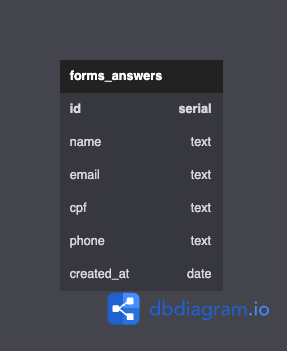

# Backend - Desafio Técnico

## 📝 Descrição

Esta é uma API REST que realiza a inscrição de clientes e armamazena o formulário no banco de dados relacional PostGresSQL.

### Banco de Dados

https://dbdiagram.io/d/6409f841296d97641d86b9e0

### Regras de negócio

1. A inscrição só é realizada com um email válido.
2. Um email só pode ser registrado uma única vez no banco de dados.
3. A propriedade "created_at" deve ser preenchida com a data de inscrição do formulário.

## 💻 Instalação

1. Clone o repositório.
2. No gerenciador de pacotes NPM, execute:

  ```sh
  npm install
  ```

3. Crie um arquivo chamado `.env` na raiz do projeto para inserir suas variáveis de ambiente.

  ```sh
  
  #Defina a porta na qual o Express será executado. Exemplo: 3003
  EXPRESS_PORT=3003
  #Defina a porta na qual o PostGresSQL será executado. Exemplo: 5432
  DB_PORT=5432
  #Informe o username relacionado ao banco de dados
  DB_USER=username
  #Informe a senha relacionada ao banco de dados
  DB_PASSWORD=password
  ```

4. Você pode utilizar a extensão MySQL (Weijan Chen) no VSCode para criar a conexão com o banco de dados pelo servidor PostGresSQL.
5. Na conexão, abra a query e execute a criação da tabela 'forms_anwers' através do comando:

  ```sh
  CREATE TABLE forms_answers(  
      id SERIAL PRIMARY KEY,
      name TEXT NOT NULL,
      email TEXT UNIQUE NOT NULL,
      cpf TEXT UNIQUE NOT NULL,
      phone TEXT NOT NULL,
      created_at DATE DEFAULT CURRENT_DATE
  );
  ```

6. Run the server.
  
  ```sh
  npm run dev
  ```

7. Você pode utilizar o Postman para testar a API. Veja mais detalhes na documentação.

## 📜 Documentation

https://documenter.getpostman.com/view/24460805/2s93JrvPxo

## 🕹 Endpoints

- Create Form
- Get Forms Between Dates

## 🛠 Technologies

- NodeJS;
- Typescript;
- Express;
- PostGresSQL;
- Knex;
- POO;
- Layered Architecture;
- Routing;
- Postman.

## 👩‍💻 Author

Laís Rodrigues Macedo </br>
📧 laisrodriguesmacedo@gmail.com </br>
📞 (+49) 174 7781517

